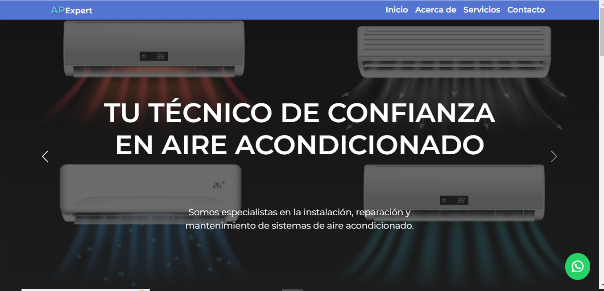

 
  

<h2 align="left">¡Hola! 👋 Soy Gisel Fernandez</h2>

 

<!-- ## 👋 &nbsp;Hey there! I'm Gisel Fernandez -->

Sobre mi

Soy una desarrolladora autodidacta que está dando sus primeros pasos en el mundo de la programación. Actualmente me enfoco en la construcción de sitios web usando tecnologías como HTML, CSS, Bootstrap y JavaScript para crear interfaces atractivas e interactivas.

Recientemente he comenzado a explorar el mundo del análisis de datos, aprendiendo herramientas como SQL, Power BI y Excel, con el objetivo de ampliar mis posibilidades profesionales y combinar desarrollo web con análisis de información.

🚀 ¿Qué estoy aprendiendo?

HTML: Estructura básica de páginas web.

CSS: Estilos y diseño visual.

Bootstrap: Framework para diseño responsive y componentes reutilizables.

JavaScript: Dinamismo e interactividad en sitios web.

SQL: Consultas y manejo de bases de datos relacionales.

Power BI: Visualización y análisis de datos.

Excel: Análisis, organización y automatización de datos con funciones y tablas dinámicas.

📚 Mi enfoque de aprendizaje:

Soy autodidacta y aprendo a través de tutoriales en línea, documentación y trabajando en proyectos reales.

Mi objetivo es seguir mejorando mis habilidades y aprender nuevas tecnologías para crear experiencias web más complejas.

### 🛠 &nbsp;Tecnologias conocidas

&nbsp;

&nbsp;
&nbsp;
&nbsp;

### 🧰 &nbsp;Control de versiones y herramientas

&nbsp;
&nbsp;
&nbsp;

### 💻 Proyectos:

Aquí puedes encontrar algunos de mis proyectos personales donde aplico todo lo que he aprendido. 

  <a href="https://apexpert.netlify.app/">
    
  

  

### 🤝🏻 &nbsp;¡Conectemos!

 

  

   
  
  

