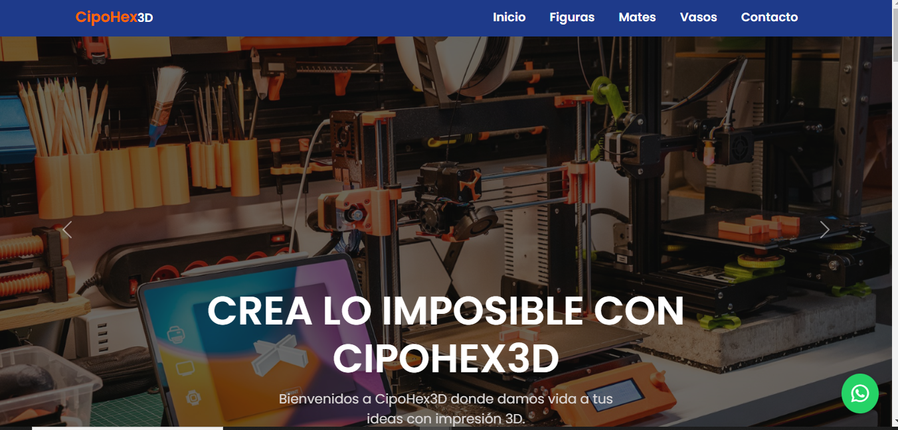

<h2 align="left">¡Hola! 👋 Soy Gisel Fernandez</h2>

 

<!-- ## 👋 &nbsp;Hey there! I'm Gisel Fernandez -->

Sobre mi

Soy una desarrolladora autodidacta que está comenzando su camino en la programación. Actualmente, estoy aprendiendo a construir sitios web usando tecnologías como HTML, CSS y Bootstrap. También estoy dando mis primeros pasos con JavaScript para darle más interactividad a mis proyectos.

🚀 ¿Qué estoy aprendiendo?

HTML: Creación de páginas web estructuradas.

CSS: Diseño y estilo de páginas web.

Bootstrap: Framework para facilitar el diseño responsive.

JavaScript: Añadir dinamismo y funcionalidades a mis sitios.

📚 Mi enfoque de aprendizaje:

Soy autodidacta y aprendo a través de tutoriales en línea, documentación y trabajando en proyectos reales.

Mi objetivo es seguir mejorando mis habilidades y aprender nuevas tecnologías para crear experiencias web más complejas.

### 🛠 &nbsp;Tecnologias conocidas

&nbsp;

&nbsp;
&nbsp;
&nbsp;

### 🧰 &nbsp;Control de versiones y herramientas

&nbsp;
&nbsp;
&nbsp;

### 💻 Proyectos:

Aquí puedes encontrar algunos de mis proyectos personales donde aplico todo lo que he aprendido. 

  <a href="https://apexpert.netlify.app/">
    
  

  

<a href="https://cipohex3d.netlify.app/">

  

</a>
  
### 🤝🏻 &nbsp;¡Conectemos!

 

  

   
  
  

